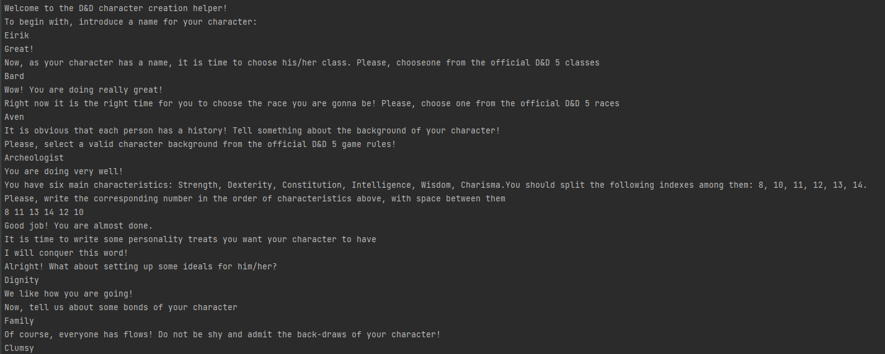
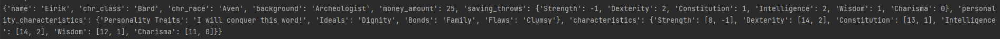

# Topic: *Creational Design Patterns* 

Author: *Graur Elena*
------
## Objectives
__1. Study and understand the Creational Design Patterns.__

__2. Choose a domain, define its main classes/models/entities and choose the appropriate instantiation mechanisms.__

__3. Use some creational design patterns for object instantiation in a sample project.__

## Theory
&nbsp;&nbsp;&nbsp; In software engineering, the creational design patterns are the general solutions that deal with object creation, trying to create objects in a manner suitable to the situation. The basic form of object creation could result in design problems or added complexity to the design. Creational design patterns solve this problem by optimizing, hiding or controlling the object creation.

Some examples of this kind of design patterns are:

   * Singleton
   * Builder
   * Prototype
   * Object Pooling
   * Factory Method
   * Abstract Factory
   
## Main tasks
__1. Choose an OO programming language and a suitable IDE or Editor (No frameworks/libs/engines allowed).__

__2. Select a domain area for the sample project.__

__3. Define the main involved classes and think about what instantiation mechanisms are needed.__

__4. Based on the previous point, implement at least 3 creational design patterns in your project.__

## Implementation
&nbsp;&nbsp;&nbsp; The main task during this laboratory work was to implement at least three creational 
patterns into a project, to get familiar with them. For this purpose, it was chosen to implement
a basic creator of the main characteristics of a D&D character*. \
&nbsp;&nbsp;&nbsp; During the laboratory work, there were implemented five creational patterns,
as follows:
* _Singleton_
* _Factory Method_;
* _Abstract Factory_;
* _Builder_;
* _Prototype Method_.

&nbsp;&nbsp;&nbsp; In the following paragraphs, it will be briefly presented the implementation of
each pattern mentioned above and its usage. Please, notice the fact that there is provided only a general
code overview in the report. For more details on the code part, consult comments presented in each
file with implementation. \
&nbsp;&nbsp;&nbsp; Let us start with the Singleton. Basically, Singleton pattern ensure only one instance
of a class type exists. In the case of this implementation, it is mandatory to ensure that only one 
character is created at a time, therefore, this pattern is applied  on the _Character_ class.
To implement _Singleton_, a global variable ___instance_ is created to keep the information if an instance
of that class already exists or not. The actual check happens in the method __new\__(), where if the 
object of that class does not exist, it initiates the object or return the existing one overwise. 

````python
__instance = None  

    def __new__(cls, *args, **kwargs):
        if cls.__instance is None:
            cls.__instance = super().__new__(cls)
            cls.__instance.__initialized = False
        return cls.__instance
````

&nbsp;&nbsp;&nbsp; The next pattern to be discussed is the _Factory Method_. In broad terms, it acts
as a manager that specify which pattern when to be used. This pattern is implemented in _ClassCreator_
file. First, there are created classes for different character's classes presented in D&D 5, like one
presented below.

````python
class Barbarian:
    def __init__(self):
        self.chr_name = 'Barbarian'
        self.characteristic = ['Strength', 'Constitution']

    def _get_name(self):
        return self.chr_name

    def _set_saving_throws(self):
        return self.characteristic
````

After this, it is created a _Factor class_, _CharacterClass_, that keeps the information about all
predefined classes of the specified class and choose the one upon the input introduced by the user.

````python
class CharacterClass:
    def __init__(self, class_name):
        self.class_name = class_name

    def get_character_class(self):
        if self.class_name == 'BARD':
            return Bard()
        elif self.class_name == "BARBARIAN":
            return Barbarian()
````

&nbsp;&nbsp;&nbsp; The next pattern to be discussed is the _Abstract Factory_. This pattern is 
implemented in both _RaceCreator_ and _BackgroundCreator_ files. In both files there exist a class 
creator that specifies the structure of class race and background, respectively, like in the example
provided below.

````python
class RaceCreator(ABC):
    @abstractmethod
    def __init__(self, race):
        self.race = race

    @abstractmethod
    def _get_race(self):
        return self.race

    @abstractmethod
    def _get_characteristics(self, character, characteristics):
        for char in characteristics:
            character.characteristics[char][0] += characteristics[char]

    @abstractmethod
    def set_race(self, character):
        pass
````

Then, there are classes for different type of races and backgrounds, that implements the respective
creator classes, like one presented as follows.

````python
class Aarakocra(RaceCreator):
    def __init__(self, race):
        super().__init__(race)
        self.characteristics = {
            'Dexterity': 2,
            'Wisdom': 1,
        }

    def _get_race(self):
        race = super()._get_race()
        return race

    def _get_characteristics(self, character, characteristics):
        super()._get_characteristics(character, self.characteristics)

    def set_race(self, character):
        character.chr_race = self._get_race()
        self._get_characteristics(character, self.characteristics)
````

&nbsp;&nbsp;&nbsp; Another pattern implemented in this project is the _Builder_ pattern, which may be 
found in _PersonalityCreator_ file.  
&nbsp;&nbsp;&nbsp; What is specific for a D&D character is the fact that he/she has its own character 
traits, ideals, bonds and flaws. All of these are a parte of the character behaviour, yet they represent
a different entity. Hence, there is an abstract class _PersonalityCreator_ presented as the Builder
abstract class, with the structure presented below.

````python
class PersonalityCreator(ABC):
    @abstractmethod
    def get_personality_characteristic(self, characteristic):
        pass
````

The instances created using this _Builder_ instances are the personality characteristics specified
earlier. A class using the abstract _Builder_ class looks as follows.

````python
class PersonalityTraits(PersonalityCreator):
    def get_personality_characteristic(self, traits):
        return traits
````

&nbsp;&nbsp;&nbsp; The last but not the least pattern is the _Prototype method_. The main goal of this
pattern is to create clones of the objects instead of creating the same object as the existing one, as
the process og object creation is a highly cost one. This pattern is implemented in _ModifierSetter_ 
file. The abstract class that specifies the cloning method looks as presented below.

````python
class AbstractModifierSetter(ABC):
    @abstractmethod
    def clone(self):
        return deepcopy(self)
````

Basically, the concrete class implements the abstract method specified above. 

````python
class ModifierSetter(AbstractModifierSetter):
    def __init__(self):
        self.character = Character()
        self.modifiers = {}

    def get_modifier(self):
        for char in self.character.characteristics:
            self.modifiers[char] = -5 + self.character.characteristics[char][0] // 2
        return self.modifiers

    def clone(self):
        copy = super().clone()
        return copy
````

The main use of it is done in other parts of code, where objects of the same type should be created, as
presented below.

````python
modifiers = ModifierSetter()
saving_throws = modifiers.clone()
````
## Results
&nbsp;&nbsp;&nbsp; The output of the project is an object of type dictionary, that contains all 
described instances of a character. Let us look at an example of a character creation.



## Conclusions
&ensp;&ensp;&ensp; Creational Design Patterns are aimed to solve the problems related to object
instantiation. A class creational pattern uses inheritanceto vary the class that's instantiated, 
whereas an object creational pattern will delegate instantiation to another object. \
&ensp;&ensp;&ensp; During this laboratory work, there was analyzed different types of creational patterns
(_Singleton_, _Factory Method_, _Abstract Factory_, _Builder_, _Prototype Method_) and was reached the
conclusion that they help in logically structuration and building of instances of different classes
and properties. Also, it was concluded that, despite all of them being creational patterns, each 
described pattern solves a different problem within the program.

____
*for more detailed information about D&D, you may visit this [link](https://dnd5.club/). 
