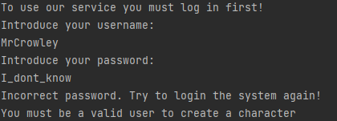
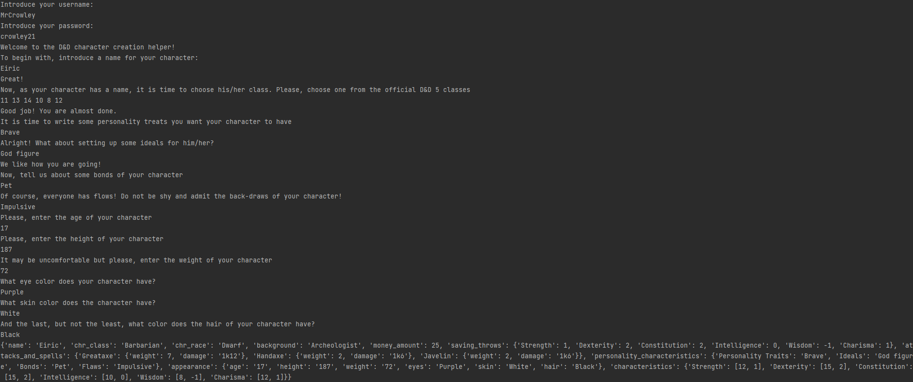

# Topic: *Structural Design Patterns*
Author: *Graur Elena*
------
## Objectives:
&ensp; &ensp; __1. Study and understand the Structural Design Patterns.__

&ensp; &ensp; __2. As a continuation of the previous laboratory work, think about the functionalities that your system will need to provide to the user.__

&ensp; &ensp; __3. Implement some additional functionalities using structural design patterns.__

## Theory
&ensp; &ensp; In software engineering, the Structural Design Patterns are concerned with how classes and objects are composed to form larger structures. Structural class patterns use inheritance to create a hierarchy of classes/abstractions, but the structural object patterns use composition which is generally a more flexible alternative to inheritance.

&ensp; &ensp; Some examples of from this category of design patterns are:

   * Adapter
   * Bridge
   * Composite
   * Decorator
   * Facade
   * Flyweight
   * Proxy
   
## Main tasks
&ensp; &ensp; __1. By extending your project, implement at least 3 structural design patterns in the project:__
  * The implemented design pattern should help to perform the tasks involved in your system.
  * The object creation mechanisms/patterns can now be buried into the functionalities instead of using them into the client.
  * There should only be one client for the whole system.

&ensp; &ensp; __2. Keep the files grouped (into packages/directories) by their responsibilities (an example project structure):__
  * client
  * domain
      * factories
      * builder 
      * models
  * utilities
  * data(if applies)

&ensp; &ensp; __3. Document your work in a separate markdown file according to the requirements presented below (the structure can be extended of course):__
  * Topic of the laboratory work
  * Author
  * Introduction/Theory/Motivation
  * Implementation & Explanation (you can include code snippets as well)
      * Indicate the location of the code snippet
      * Emphasize the main idea and motivate the usage of the pattern
  * Results/Screenshots/Conclusions

## Implementation
&nbsp;&nbsp;&nbsp; The main task during this laboratory work was to implement at least three structural 
patterns into a project and to get familiar with them. It wa decided to extend the project started
in the previous laboratory work, aimed to build a creator of the main characteristics of a D&D 
character*. \
&nbsp;&nbsp;&nbsp; During this laboratory work, in addition to the creational patters from the first
laboratory work, there were implemented five structural patterns, as follows:
* _Adapter_
* _Composite Method_;
* _Facade Method_;
* _Decorator_;
* _Proxy Method_.

&nbsp;&nbsp;&nbsp; In the remaining part of this subsection, it will be briefly presented the 
implementation of each pattern specified above and its usage. Please, notice the fact that there 
is provided only a general code overview in the report. For more details on the code part, consult 
comments presented in each file with implementation. \
&nbsp;&nbsp;&nbsp; The first structural pattern to describe will be the _Adapter_ pattern. Generally 
speaking, the _Adapter_ is a pattern that allows objects with different interfaces to collaborate.
As probably the name suggests, this  pattern change the interfaces of incompatible methods and 
creates a _bridge_ between them so the client would be able to work with the together. \
&nbsp;&nbsp;&nbsp; In the _D&D_ world, some characters have attacks based on the type of 
weapons they have, while other character have magic powers, therefore they have spells. These 
characteristics are determined by the class they belong to, that is why there was added a new
characteristic in character class description, which is the type of attacks or spells he/she is 
allowed to use.

````python
def _set_damage_methods(self):
    character_spells = CharacterSpells()
    for spell in self.spells:
        character_spells.add_spell(spell)
    return character_spells
````

````python
def _set_damage_methods(self):
    character_attacks = CharacterAttacks()
    for weapon in self.weapons:
        character_attacks.add_attack(weapon)
    return character_attacks
````

&nbsp;&nbsp;&nbsp; In the class calling the character class creation is used only one method to get information either 
about the character's attacks or spells, that being _get_damage_method()_. Therefore, it is 
necessary to generalize the two methods described above so the client would be able to use them, not
knowing which type of damage the current character has. For this purpose, a class Adapter was created
that get the methods of the input class and push it to the AdapteeClass, which calls the method
according to the class it belongs to.

````python
class DamageAdapter:
    def __init__(self, damage_type, adapted_methods):
        self.damage_type = damage_type
        self.__dict__.update(adapted_methods)

    def __str__(self):
        return str(self.damage_type)
````

````python
class DamageAdaptee:
    def __init__(self, damage_type):
        self.damage_type = damage_type

    def get_damage_method(self):
        if self.damage_type.__class__.__name__ == 'CharacterSpells':
            damages = DamageAdapter(self.damage_type, dict(execute=self.damage_type.get_spells))
            return damages
        else:
            damages = DamageAdapter(self.damage_type, dict(execute=self.damage_type.get_attacks))
            return damages
````

&nbsp;&nbsp;&nbsp; Therefore, in the client clas only the _get_damage_type()_ and _execute()_ method are called, not
counting what type of character the user is creating. \
&nbsp;&nbsp;&nbsp; It is important to mention that each weapon or spell name is mentioned in the
character's default parameters, in the ___init___ method. The damage and other characteristics of
weapon or spells are described in separated classes. Here is where the _Composite Method_ comes in.
Basically, _Composite Method_ compose objects into tree structures to represent part-whole 
hierarchies and lets clients treat individual objects and compositions of objects uniformly. 
In the project, each attack and spell class is a leaf element that has the structures as presented
below.

````python
class Greataxe(Weapon):
    def __init__(self):
        super().__init__(name='Greataxe', weight=7, damage='1k12')

    def get_characteristics(self):
        return {self.name: {'weight': self.weight, 'damage': self.damage}}
````

````python
class AcidSplash(Spell):
    def __init__(self):
        super().__init__(name='Acid Splash', s_range=60, duration='Instantaneous')

    def get_characteristics(self):
        return {self.name: {'s_range': self.s_range, 'duration': self.duration}}
````

The composite element is the list of spells or attacks that are pushed to the character 
description and is stored to get more information about him/her.

````python
class CharacterAttacks:
    def __init__(self):
        self.attacks = []

    def __create_attack_class(self, weapon):
        concrete_weapon = Attack(weapon).get_attack()
        return concrete_weapon.get_characteristics()

    def add_attack(self, attack):
        attack_class = self.__create_attack_class(attack)
        self.attacks.append(attack_class)

    def remove_attack(self, attack):
        self.attacks.remove(attack)

    def get_attacks(self):
        return self.attacks
````

````python
class CharacterSpells:
    def __init__(self):
        self.spells = []

    def __create_spell_class(self, spell):
        concrete_spell = Spells(spell).get_spell()
        return concrete_spell.get_characteristics()

    def add_spell(self, spell):
        spell_class = self.__create_spell_class(spell)
        self.spells.append(spell_class)

    def remove_spell(self, spell):
        self.spells.remove(spell)

    def get_spells(self):
        return self.spells
````

&nbsp;&nbsp;&nbsp; The next pattern implemented in this laboratory work is the _Facade_ Method.
It provides a simpler unified interface for a more complex system. In terms of this project,
there is some general information each _D&D_ character must have: name, class, race and background.
Except the name of the character, each characteristic is described by a class and to build each
of them a certain action must be called. That is why, _Facade Method_ is an ideal way to unify
them and call just one simple method in from the client side. The _Facade_ implementation is 
shown below.

````python
class CharacterGeneralInformation:
    def __init__(self, character, name, class_name, race, background):
        self.character = character
        self.name = name
        self.class_name = class_name
        self.race = race
        self.background = background

    def __initialize_general_info(self):
        class_setter = ClassSetter(self.class_name)
        race_setter = RaceSetter(self.race)
        background_setter = BackgroundSetter(self.background)
        return class_setter, race_setter, background_setter

    def get_character_general_data(self):
        class_setter, race_setter, background_setter = self.__initialize_general_info()
        self.character.name = self.name
        class_setter.set_character_class()
        race_setter.set_race()
        background_setter.set_background()
````

Given this implementation, the only interaction from the client side to get the general
information of the character is as follows.

````python
def __set_character_general_info(self, name, class_name, race_name, background):
    general_info_setter = CharacterGeneralInformation(self.character, name, class_name, 
                                                      race_name, background)
    general_info_setter.get_character_general_data()
````

&nbsp;&nbsp;&nbsp; Another structural pattern implemented in this laboratory work is the 
_Decorator_. As the name suggests, it allows adding new behaviors to objects dynamically by 
placing them inside special wrapper objects, called decorators. In the context of this
project, it is used to offer character characteristics, such as eyes color, height, age and 
so on. The basic class of the character appearance looks as follows:

````python
class CharacterAppearance:
    def __init__(self, character):
        self.character = character

    def render(self):
        return self.character
````

A general wrapper that decorated the basic class of the character appearance contains the same
methods and has the form presented below.

````python
class Age:
    def __init__(self, wrapped):
        self._wrapped = wrapped
        self.__age = ''

    def __get_age(self):
        print('Please, enter the age of your character')
        self.__age = input()
        return self.__age

    def render(self):
        character = self._wrapped.render()
        character.appearance['age'] = self.__get_age()
        return character
````

&nbsp;&nbsp;&nbsp; The last but not the least structural pattern used in this laboratory
work is _Proxy Method_. This pattern provides a surrogate or placeholder for another object 
to control access to it. In terms of this project, it was decided that it was not allowed 
the user who are not registered to get any information or allowance to create a character. 
That is why, an improvised database was created, that may be found in _CharacterCreationDataBase_
file. In the _Proxy_ class, the checking of the introduced character data is performed and,
based on the input, the user is either allowed or denied going forward in the character
creation process.

````python
class CharacterCreationProxy:
    def __init__(self):
        self.db = Database()
        self.character_creator = None

    # check if the introduced username is in database
    def __check_user_existence(self, username):
        if self.db.check_user(username):
            return True
        # ask for another username in case a wrong one was introduces
        else:
            print('Incorrect username. Try again!')
            return False

    # validate the user according to the password he/she introduced
    def __check_password(self, username, password):
        if self.db.verify_user_password(username, password):
            return True
        else:
            print('Incorrect password. Try to login the system again!')
            return False

    # process of user's registration
    def login_user(self):
        print('To use our service you must log in first!')
        print('Introduce your username: ')
        username = input()
        if self.__check_user_existence(username):
            print('Introduce your password:')
            password = input()
            if self.__check_password(username, password):
                return CharacterCreator()
            # Exit the system if the wrong password was introduced
            else:
                return False
        else:
            self.login_user()
````


## Results
&nbsp;&nbsp;&nbsp; The output of the project is an object of type dictionary, that contains all 
described instances of a character. Bellow, an invalid attempt of character creation (blocked
by _Proxy Method_) and a valid character creation are presented. 
* Unsuccessful attempt of character creation



* Successful character creation




# Conclusions
&ensp;&ensp;&ensp; Structural Design Patterns explain how to assemble objects and classes into 
larger structures, while keeping these structures flexible and efficient. Structural class 
patterns use inheritance to compose interfacesor implementations. \
&ensp;&ensp;&ensp; During this laboratory work, there was analyzed different types of structural patterns
(_Adapter_, _Composite Method_, _Facade Factory_, _Decorator_, _Proxy Method_) and was reached 
the conclusion that they help in logically structuration and combination of incompatible
classes to be used under the same conditions by the user. Moreover, they simplify the structure by 
identifying the relationships. \
&ensp;&ensp;&ensp; Nonetheless, it was concluded that, despite all of them being structural 
patterns, each described pattern solves a different problem within the program.

____
*for more detailed information about D&D, you may visit this [link](https://dnd5.club/). 