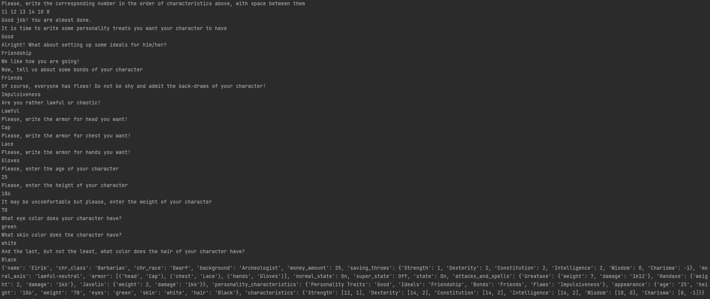

# Topic: *Behavioral Design Patterns*
## Author: *Graur Elena*
------
## Objectives
&ensp; &ensp; __1. Study and understand the Behavioral Design Patterns.__

&ensp; &ensp; __2. As a continuation of the previous laboratory work, think about what communication between software entities might be involed in your system.__

&ensp; &ensp; __3. Implement some additional functionalities using behavioral design patterns.__

## Theoretical background
&ensp; &ensp; In software engineering, behavioral design patterns have the purpose of identifying common 
communication patterns between different software entities. By doing so, these patterns increase 
flexibility in carrying out this communication.

&ensp; &ensp; Some examples from this category of design patterns are :

   * Chain of Responsibility
   * Command
   * Interpreter
   * Iterator
   * Mediator
   * Observer
   * Strategy
   
## Main tasks 
&ensp; &ensp; __1. By extending the project, implement at least 1 behavioral design pattern in your 
project:__
  * The implemented design pattern should help to perform the tasks involved in your system.
  * The behavioral DPs can be integrated into you functionalities alongside the structural ones.
  * There should only be one client for the whole system.
  
&ensp; &ensp; __2. Keep the files grouped (into packages/directories) by their responsibilities 
(an example project structure):__
  * client;
  * domain;
  * utilities;
  * data(if applies);
  
&ensp; &ensp; __3. Document the work in a separate markdown file according to the requirements presented 
below (the structure can be extended of course):__
  * Topic of the laboratory work.
  * Author.
  * Introduction/Theory/Motivation.
  * Implementation & Explanation (you can include code snippets as well):
    * Indicate the location of the code snippet.
    * Emphasize the main idea and motivate the usage of the pattern.
  * Results/Screenshots/Conclusions


## Implementation
&nbsp;&nbsp;&nbsp; The main task during this laboratory work was to implement at least three structural 
patterns into a project and to get familiar with them. It wa decided to extend the project started
in the previous laboratory work, aimed to build a creator of the main characteristics of a D&D 
character*. \
&nbsp;&nbsp;&nbsp; During this laboratory work, in addition to the creational patters from the first
laboratory work, there were implemented five structural patterns, as follows:
* _Command_
* _State_;
* _Strategy_;
* _Template Method_;
* _Mediator_.

&nbsp;&nbsp;&nbsp; In the remaining part of this subsection, it will be briefly presented the 
implementation of each pattern specified above and its usage. Please, notice the fact that there 
is provided only a general code overview in the report. For more details on the code part, consult 
comments presented in each file with implementation. \
&nbsp;&nbsp;&nbsp; The first behavioural pattern to describe will be the _Command_ pattern. Generally 
speaking, Command decouples the object that invokes the operation from the one that knows how
to perform it. To achieve this separation, the designer creates an abstract base class that 
maps a receiver (an object) with an action (a pointer to a member function). In the developed project, 
the pattern found its place s the class that is called when the character construction is initiated. 
To implement the _Command_ pattern, an abstract _Command_ class is built, that describes the
basic structure of a command. Also, the _Invoker_, _Receiver_ and concrete command class (_UserCreator_)
are defined for the purposes their names suggest.

````python
class ICommand(metaclass=ABCMeta):
    @staticmethod
    @abstractmethod
    def execute():
        pass
````

````python
class Invoker:
    def __init__(self):
        self._commands = {}

    def register(self, command_name, command):
        self._commands[command_name] = command

    def execute(self, command_name):
        if command_name in self._commands.keys():
            self._commands[command_name].execute()
        else:
            print(f"Command [{command_name}] not recognised")
````

````python
# Receiver class
class Receiver:
    @staticmethod
    def run_command():
        pass
````

The classes and their instances are initiated and called in _main_, such as _Invoker_ initiates the call,
while _Receiver_ is the one that indicates the object it refers to.

````python
receiver = Receiver()
invoker = Invoker()
command = CharacterCreator(receiver)
invoker.register("custom_call", command)
invoker.execute("custom_call")
command.show_character()
````


&nbsp;&nbsp;&nbsp; The characters in D&D may become stronger after performing some tasks or achieving
some targets. However, this effect lasts for a short period of time, after which they are back to
their normal state. To describe these states, the _State_ pattern was used.\
&nbsp;&nbsp;&nbsp; The main idea of State pattern is to allow the object for changing its behavior 
without changing its class. Also, by implementing it, the code should remain cleaner without many 
if/else statements. In order show the states of the character, using _State_ pattern, a class
was created.

````python
class State:
    def check_special(self):
        self.range += 1
        if self.range == len(self.addons):
            self.range = 0
            self.switch_to_state()

    def __repr__(self):
        if self.range != 0:
            return 'On'
        else:
            return 'Off'
````

The class defines the basic concept of a state in the context of the character. To describe his/her
particular condition, _NormalState_ and _SuperState_ were created.

````python
class NormalState(State):
    def __init__(self, character):
        self.character = character
        self.addons = ['1 up', '2 up', '3 up']
        self.range = 1

    def switch_to_state(self):
        self.character.state = self.character.super_state
````

````python
class SuperState(State):
    def __init__(self, character):
        self.character = character
        self.addons = ['1 down', '2 down', '3 down']
        self.range = 0

    def switch_to_state(self):
        self.character.state = self.character.normal_state
````

Once a character reaches three "ups" his/her _NormalState_ is changed into _SuperState_.
Following the same logic, three "downs" brings the character from _SuperState_ to
_NormalState_. The status of each states of the character are kept as the character's 
personal data and are shown at the output. \
&nbsp;&nbsp;&nbsp; The next implemented pattern is the _Strategy_. It lets you define a 
family of algorithms, put each of them into a separate class, and make their objects 
interchangeable. In context of the project, the pattern was used to determine the moral 
axis of the character based on its input. The compositor class is a simple function
that gives a classification to the character, calling the function based on the 
user's input.

````python
class MoralAxis:
    def __init__(self, life_strategy=None):
        self.moral_axis = 'neutral'
        self.life_strategy = life_strategy

    def __get_moral_axis(self):
        if self.life_strategy:
            self.moral_axis = self.life_strategy(self)
        else:
            self.moral_axis = 'true-neutral'
        return self.moral_axis

    def set_moral_axis(self):
        morality = self.__get_moral_axis()
        character = Character()
        character.moral_axis = morality
````

The concrete strategies, as it follows from name, define concrete actions to be
implemented in dependence og the user's inout.

````python
class Lawful:
    @staticmethod
    def set_moral_axis(moral_axis):
        return 'lawful-' + moral_axis.moral_axis
````

````python
class Chaotic:
    @staticmethod
    def set_moral_axis(moral_axis):
        return 'chaotic-' + moral_axis.moral_axis
````

&nbsp;&nbsp;&nbsp; Another behaviour pattern implemented in this laboratory work
is the _Template Method_. Template method defines the steps to execute an algorithm. 
It can provide default implementation that might be common for all or some of 
the subclasses. \
&nbsp;&nbsp;&nbsp; In the developed project, the _Template Method_ was especially used
in spells classes definition. Firstly, a general abstract class that shows the spells
classes description was defined.

````python
class Spell(ABC):
    @abstractmethod
    def __init__(self, name, s_range, duration):
        self.name = name
        self.s_range = s_range
        self.duration = duration

    @abstractmethod
    def get_characteristics(self):
        pass
````

&nbsp;&nbsp;&nbsp; The last, but not the least in terms of importance, behaviour 
pattern implemented in this laboratory work is the _Mediator_ pattern. Mediator pattern is 
used to reduce communication complexity between multiple objects or classes. This pattern 
provides a mediator class which normally handles all the communications between different 
classes and supports easy maintenance of the code by loose coupling. \
&nbsp;&nbsp;&nbsp; Coming back to D&D, each character has the ability to wear an armor.
However, armors may be of different types, especially according to the area they should be 
applied on. Moreover, the armors should not interfere with each other and affect the 
performance of another armor. Here is the part where _Mediator_ pattern comes in. Each
armor, indifferent of its type, is initiated as a class _Character_ instance, the
action being performed in one of the _Armor_ class methods.

````python
class Armor:
    def __init__(self, armor_type):
        self.type = armor_type
        self.character = Character()

    def __str__(self):
        return self.type

    def set_new_armor(self, armor_name):
        self.character.armor.append((self.type, armor_name))
````

Now, every time an armor will be built, it will be created separated from 
other armors, at least from communication perspective. All the possible
communications between two objects of type "Armor" is almost impossible
without the _Mediator_.

````python
    def __set_character_armor(self, armor):
        for piece in armor:
            Armor(piece[1]).set_new_armor(piece[0])
````

## Results
&nbsp;&nbsp;&nbsp; The output of the project is an object of type dictionary, that contains all 
described instances of a character. Bellow, it is presented the basic character information which is output
after finalizing creation process.




# Conclusions
&ensp;&ensp;&ensp; Behavioral pattern abstracts an action you want to take from the object or class that 
takes the action. By changing the object or class, it is possible to change the algorithm used, the objects 
affected, or the behavior, while still retaining the same basic interface for client classes. \
&ensp;&ensp;&ensp; During this laboratory work, there was analyzed different types of behavioural patterns
(_Command_, _State_, _Strategy_, _Template Method_, _Mediator_) and was reached 
the conclusion that they help build interaction between objects in such a way that they can easily talk to 
each other and still should be loosely coupled. \
&ensp;&ensp;&ensp; Nonetheless, it was concluded that, despite all of them being behaviour 
patterns, each of them solves a different problem within the program.

____
*for more detailed information about D&D, you may visit this [link](https://dnd5.club/). 

